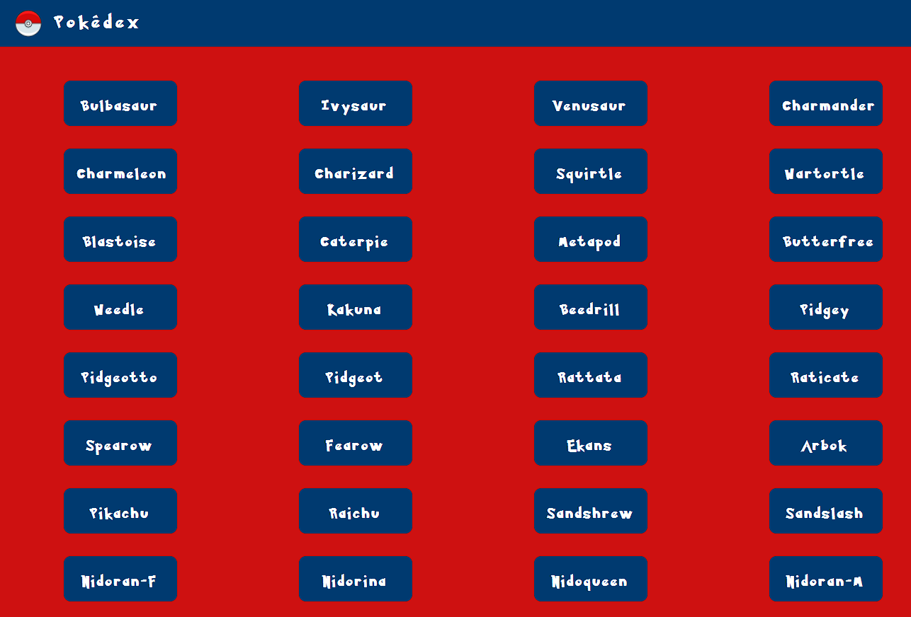

Simple JS Pokedex project  
A small web application that loads data from an external API and enables the viewing of different Pokémon in detail. Built with HTML, CSS, and JavaScript, jQuery and Bootstrap.

User Goals   
Users should be able to view a list of 151 pokemon and see more details for a given pokemon on demand.

Key Features  
Load data from an external source (API)  
View a list of items  
On user action (e.g., by clicking on a list item), view details for that item  
Technical Requirements  
The app must load data from an external API; for instance, the Pokémon API.  
The app must display a list of items loaded from that API after the page is loaded.  
The app must enable the viewing of more details for a given list item (like a Pokémon) on demand, such as when clicking on a list item.  
The app must have CSS styling.  
The JavaScript code must be formatted according to ESLint rules.  
The JavaScript code may be formatted via Prettier.  
The JavaScript code may be manually formatted.  
The app must use at least one additional complex UI pattern, such as a modal, for details or touch interactions.  
The app may allow searching for items (e.g., searching for Pokémon).  
The app must not throw any errors when being used.  
The app should be deployed to a publicly accessible platform like GitHub Pages (you can review how to do this in Intro to Frontend Development's Exercise 10: Code Quality, Testing, & Web Hosting).  
The app must work in Chrome, Firefox, Safari, Edge  
